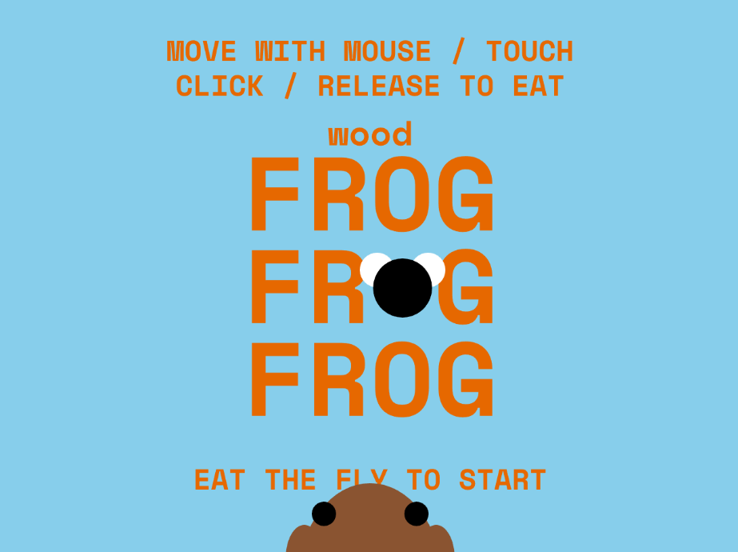

# WOOD FROG FROG FROG
Original game by Pippin Barr
Adaptation by Émile Bédard

[View this project online](https://emilebedard.github.io/cart253/Projects/mod-jam/)

## Description

This game lets you be a wood frog for a moment and enjoy the thrill of eating insects! Eat enough and reach the end of the canvas to hibernate.

> This Program is interactive! Follow the instructions provided on main screen. On desktop, use "A" and "L" keys to move and "spacebar" to eat

> Try it on mobile! use touch to move and release touch to eat

> This program is utilizing the [p5.js](https://p5js.org) library and functions

> This game is adapting the original **Frog Frog Frog** game by Pippin Barr. Here is every modification that was implemented:
- 
## Screenshot(s)

Still of main menu of the game

> 

## Attribution

> - This project uses [p5.js](https://p5js.org).
> - The image is a screenshot of the program running

## License

> This project is licensed under a Creative Commons Attribution ([CC BY 4.0](https://creativecommons.org/licenses/by/4.0/deed.en)) license with the exception of libraries and other components with their own licenses.