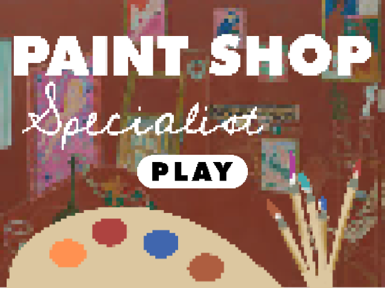
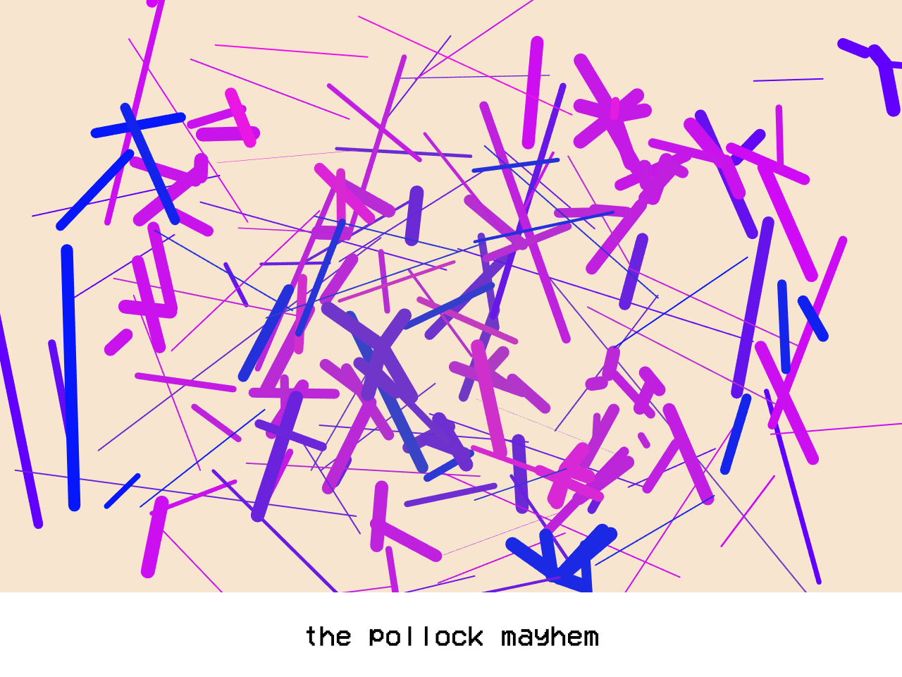
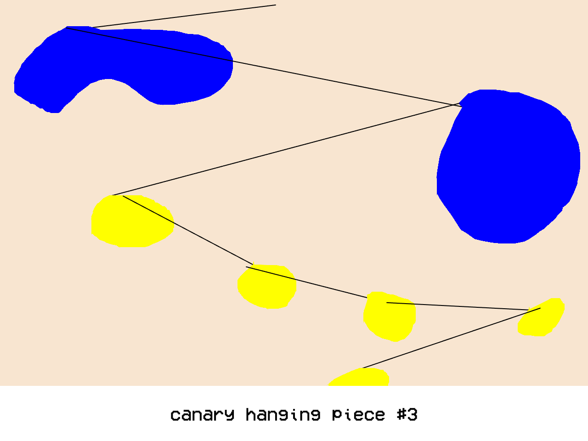
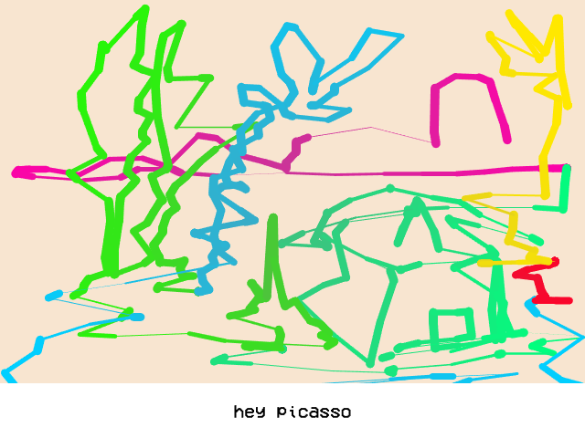

# Paint Shop Specialist!
 
Émile Bédard

[View this project online](URL_FOR_THE_RUNNING_PROJECT)

## Description

This program is a painting simulator that explores different eras of art history and movements to influence the way the user draws. Using your mouse, you can draw like Vincent Van Gogh, Pablo Picasso, Kasimir Malevitch, Alexander Calder and Jackson Pollock. Save your paintings and build your own mini gallery with Paint Shop Specialist!
 
## Screenshot(s)

images of main menu, and three paintings

> 
> 
> 
> 

## Attribution

This bit should attribute any code, assets or other elements used taken from other sources. For example:

> - This project uses [p5.js](https://p5js.org).
> - The clown image is a capture of the clown from the Apple emoji character set.
> - The barking sound effect is "single dog bark 1" by crazymonke9 from freesound.org: https://freesound.org/people/crazymonke9/sounds/418107/

## License

This bit should include the license you want to apply to your work. For example:

> This project is licensed under a Creative Commons Attribution ([CC BY 4.0](https://creativecommons.org/licenses/by/4.0/deed.en)) license with the exception of libraries and other components with their own licenses.